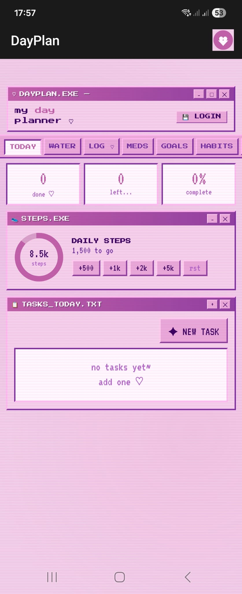

# DayPlan

A personal daily planner I built for myself, with a Y2K interface and voice input in Russian.

I tried a lot of planner apps and none of them quite worked the way I wanted, so I built my own. It is not meant to compete with anything — it is just my planner, made public in case anyone else likes how it works.

## What it does
- Daily planning with tasks and time blocks
- Voice input (Russian)
- Habit tracking
- Mood tracking
- Goals
- Syncs to Google Drive

## Stack
HTML, CSS, JavaScript. No framework. Hosted on GitHub Pages.

## Try it
[naalstepanova.github.io/DayPlan](https://naalstepanova.github.io/DayPlan)

## Screenshots

## Why Y2K
Because I wanted it to feel like a tool, not a productivity app. The early-2000s aesthetic makes me actually want to open it every morning.
